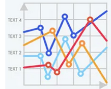
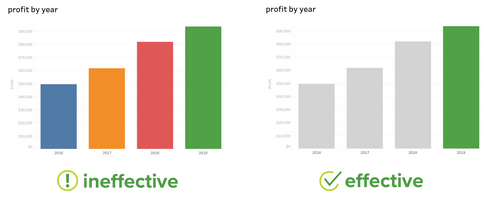

When students first learn machine learning, the focus is usually on **models** — linear regression, decision trees, neural networks, boosting methods.

But in practice, experienced data scientists know:

> Better features often beat better models.

Feature engineering is the process of transforming raw data into representations that make learning easier for algorithms. In many real-world projects, this step determines whether your model succeeds or fails.

- - -

## Why Feature Engineering Matters

Consider a simple regression problem.

If you model:

```
y = w1x + b
```

but the true relationship is quadratic, your model will underperform.

However, if you create a new feature:

```
x_squared = x^2
```

your linear model can now approximate a nonlinear relationship.

The model didn’t change.\
The features did.

- - -

## Types of Features

Feature engineering typically involves one or more of the following:

### 1. Transformation

Transform numerical values to improve structure.

Examples:

* Log transformation
* Square root scaling
* Normalisation
* Standardisation

| Transformation  | When to Use           |
| --------------- | --------------------- |
| Log             | Skewed distributions  |
| Standardisation | Gradient-based models |
| Min–Max Scaling | Neural networks       |

- - -

### 2. Encoding Categorical Variables

Most models cannot handle raw categorical text.

Example raw column:

```
City: Sydney, Melbourne, Perth
```

Common encoding strategies:

* One-hot encoding
* Ordinal encoding
* Target encoding

Example (one-hot):

```
Sydney -> [1, 0, 0]  
Melbourne -> [0, 1, 0]  
Perth -> [0, 0, 1]
```

Be careful with:

* High-cardinality categories
* Data leakage from target encoding

- - -

### 3. Interaction Features

Sometimes relationships emerge only when variables interact.

Example:

```
income * age  
temperature * humidity
```

Interaction terms allow linear models to capture multiplicative behaviour.

- - -

### 4. Aggregations

Especially important in tabular and time-series data.

Example:

* Average purchases per user
* Number of transactions in last 30 days
* Maximum session duration

These often transform event-level data into user-level features.



- - -

## Feature Engineering for Different Data Types

### Tabular Data

Focus on:

* Scaling
* Missing value imputation
* Interaction terms
* Aggregations

### Time Series

Common features:

* Lag values
* Rolling means
* Rolling standard deviation
* Trend indicators

Example:

```
rolling_mean_7_days  
rolling_std_30_days
```

### Text Data

Typical pipeline:

1. Tokenisation
2. Stop-word removal
3. TF-IDF vectorisation
4. Embeddings

Even with large language models, preprocessing still matters.

- - -

## Handling Missing Values

Missing data is not just an inconvenience — it can contain signal.

Common strategies:

* Mean/median imputation
* Constant value (e.g., 0 or -1)
* Predictive imputation
* Indicator variables

Example:

```
age_missing_flag = 1 if age is missing else 0
```

Sometimes the fact that a value is missing is itself predictive.

- - -

## Avoiding Data Leakage

A critical mistake in feature engineering is introducing leakage.



Data leakage occurs when information from the future or test set influences training.

Example of leakage:

* Using full-dataset mean instead of training-set mean
* Creating rolling features that look ahead
* Encoding categories using global target statistics

Always:

* Split data first
* Engineer features inside training folds
* Validate carefully

- - -

## Practical Workflow

A common student-friendly workflow:

1. Explore distributions
2. Identify skewness
3. Check correlations
4. Handle missing data
5. Encode categoricals
6. Add interaction terms
7. Validate with cross-validation

Repeat.

Feature engineering is iterative.

- - -

## When to Stop Engineering Features

It’s tempting to keep adding features indefinitely.

But:

* More features increase overfitting risk
* Model complexity increases
* Interpretability decreases

A good rule:

> Add features only when they have a hypothesis behind them.

Avoid blind feature generation unless using automated feature tools with proper validation.

- - -

## Feature Importance as Feedback

After training a model, inspect:

* Feature importance scores
* SHAP values
* Coefficients
* Partial dependence

These help answer:

* Which features matter?
* Which are redundant?
* Which may be leaking?

Example interpretation:

```
feature_importance:  
income: 0.42  
age: 0.18  
location_encoded: 0.07
```

This informs your next iteration.

- - -

## Advanced Concepts

### Dimensionality Reduction

Techniques like:

* Principal Component Analysis
* Autoencoders

can compress features while retaining signal.

### Feature Selection

Methods include:

* Recursive feature elimination
* L1 regularisation
* Tree-based importance filtering

- - -

## Common Mistakes Students Make

* Scaling before splitting data
* Forgetting to encode categoricals
* Creating thousands of sparse dummy variables
* Ignoring domain knowledge
* Overcomplicating simple datasets

Remember:

> The goal is not to create more features.\
> The goal is to create better representations.

- - -

## Final Thoughts

In student projects, competitions, and industry roles, feature engineering often matters more than model choice.

A simple model with well-designed features will usually outperform:

* A complex model
* Trained on poorly structured data

If you want to level up as a data scientist:

* Study your data deeply
* Think about how information flows
* Engineer features intentionally
* Validate rigorously

Mastering feature engineering transforms you from someone who *applies models* to someone who *designs solutions*.
