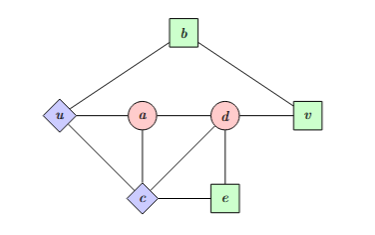

When students first learn machine learning, the focus is usually on models — linear regression, decision trees, neural networks, or boosting methods. It is natural to think that the model is the most important part of any project. However, in practice, experienced data scientists know that **better features often beat better models**. The way we represent data can make or break a model, no matter how sophisticated it is.

Feature engineering is the process of transforming raw data into representations that make learning easier for algorithms. It is a step often overlooked by beginners, but in real-world projects, this step determines whether a model succeeds or fails. By carefully creating new variables, handling missing values, or transforming data, we can dramatically improve model performance.

- - -

## Why Feature Engineering Matters

Imagine a simple regression problem. If you model a target `y` as a linear function of a single input `x`, but the true relationship is quadratic, your model will underperform. Adding a new feature like `x_squared = x^2` allows a linear model to approximate nonlinear relationships. In this case, the model itself did not change — the power came from the features. 

> Features are the lens through which the model sees the data.

Good features provide signal, reduce noise, and sometimes even make it possible to use simpler models instead of complex ones. Poor features, by contrast, can leave even a high-performing model struggling.

- - -

## Common Feature Engineering Techniques

There are many ways to engineer features, depending on your data. Numerical transformations are often the first step. For skewed distributions, a log or square root transformation can help. Standardization or normalization is frequently required for models that are sensitive to feature scale, such as neural networks or gradient-based models.
Categorical variables often need to be encoded. Whether through one-hot encoding, ordinal encoding, or target encoding, this step allows models to handle textual or nominal inputs. Interactions between features can also provide additional signal. For instance, combining income and age into an interaction term can capture relationships that would otherwise be invisible to the model. Aggregations are another important class of features, especially for event-level or time-series data. Summarizing transactions, calculating averages over time windows, or extracting counts can transform raw events into meaningful predictors.

### Handling Time-Series and Text Data

Feature engineering extends to all types of data. In time-series datasets, creating lag features, rolling averages, or trend indicators can provide the model with context about previous events. In text data, careful preprocessing — such as tokenization, stop-word removal, or vectorization — can dramatically influence the quality of the learned representations. Even when using large language models, these preprocessing steps often matter for downstream tasks.

### Handling Missing Values

Missing data is more than just a nuisance; it often contains information. Common strategies include filling with mean or median values, using a constant placeholder, or creating an indicator variable to mark missingness. For example, `age_missing_flag = 1 if age is missing else 0` can itself be a predictive feature. This approach is often underutilized by beginners but can yield surprisingly strong results.

### Avoiding Data Leakage

A critical risk in feature engineering is data leakage, where information from the test set or future data influences the training process. Leakage can occur through using global statistics to encode categories, creating rolling features that look ahead, or improperly scaling data before splitting it. The best practice is always to split your data first, then engineer features on the training set only, and validate carefully.

- - -

## Practical Workflow

A student-friendly workflow often begins with exploration: plotting distributions, examining correlations, and identifying missing values. Next comes preprocessing: handling missing data, scaling, and encoding variables. Then comes the creative part: creating interaction features, aggregating data, or engineering new transformations. After training a model, inspecting feature importance and partial dependence can provide feedback for further iterations. Feature engineering is an iterative process, informed by both domain knowledge and model behavior.

## Advanced Concepts

Dimensionality reduction techniques like Principal Component Analysis or autoencoders can compress features while retaining signal. Feature selection methods such as recursive feature elimination or L1 regularization can help reduce noise. Even in advanced settings, the core principle remains: better representations often trump more complex models.

- - -

## Final Thoughts

Students often make predictable errors. These include scaling data before splitting it, forgetting to encode categorical variables, or creating an excessive number of dummy variables. Ignoring domain knowledge and overcomplicating simple datasets are also common pitfalls. Remember: **the goal is not to create more features, but to create better representations of the data.**

Feature engineering is often the single biggest lever in data science projects. A simple model with well-engineered features can outperform a complex model trained on poorly structured data. For students learning data science, mastering feature engineering transforms you from someone who applies models to someone who **designs solutions**. It is both a science and an art, requiring creativity, experimentation, and attention to detail.
